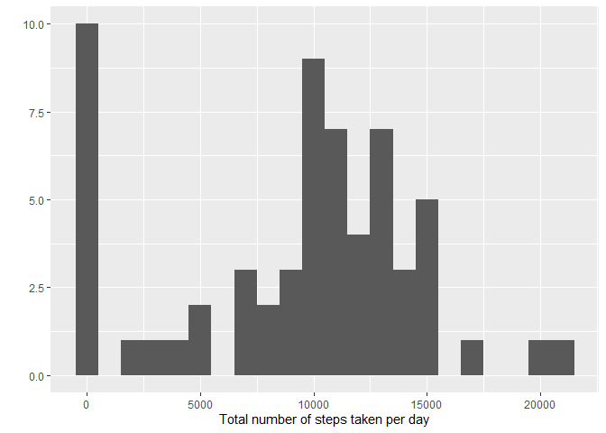
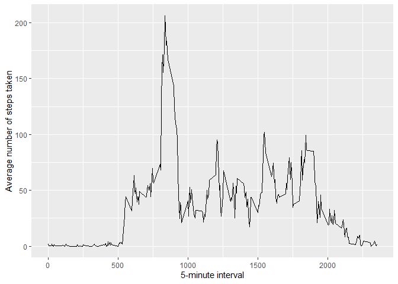
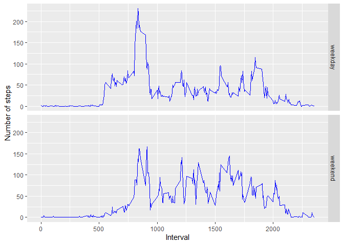

## Loading and preprocessing the data


``` r
unzip(zipfile="activity.zip")
data <- read.csv("activity.csv")
str(data)
```

```
## 'data.frame':	17568 obs. of  3 variables:
##  $ steps   : int  NA NA NA NA NA NA NA NA NA NA ...
##  $ date    : chr  "2012-10-01" "2012-10-01" "2012-10-01" "2012-10-01" ...
##  $ interval: int  0 5 10 15 20 25 30 35 40 45 ...
```

## What is mean total number of steps taken per day?


``` r
library(ggplot2)
total.steps <- tapply(data$steps, data$date, FUN=sum, na.rm=TRUE)
qplot(total.steps, binwidth=1000, xlab="Total number of steps taken per day")
```

```
## Warning: `qplot()` was deprecated in ggplot2 3.4.0.
## This warning is displayed once every 8 hours.
## Call `lifecycle::last_lifecycle_warnings()` to see where this warning was
## generated.
```

<!-- -->

``` r
mean(total.steps, na.rm=TRUE)
```

```
## [1] 9354.23
```

``` r
median(total.steps, na.rm=TRUE)
```

```
## [1] 10395
```


## What is the average daily activity pattern?

``` r
library(ggplot2)
averages <- aggregate(x=list(steps=data$steps), by=list(interval=data$interval),
                      FUN=mean, na.rm=TRUE)
ggplot(data=averages, aes(x=interval, y=steps)) +
        geom_line() +
        xlab("5-minute interval") +
        ylab("Average number of steps taken")
```

<!-- -->

On average across all the days in the dataset, the following 5-minute interval contains the maximum number of steps:

``` r
averages[which.max(averages$steps),]
```

```
##     interval    steps
## 104      835 206.1698
```


## Imputing missing values
There are a number of days/intervals where there are missing values (coded as NA). 
The presence of missing days may introduce bias into some calculations or summaries of the data.

``` r
missing <- is.na(data$steps)
table(missing)
```

```
## missing
## FALSE  TRUE 
## 15264  2304
```


# Filling in each missing value with the mean value of its 5-minute interval
All of the missing values are filled in with mean value for that 5-minute
interval.

``` r
fill.value <- function(steps, interval) {
        filled <- NA
        if (!is.na(steps))
                filled <- c(steps)
        else
                filled <- (averages[averages$interval==interval, "steps"])
        return(filled)
}

filled.data <- data
filled.data$steps <- mapply(fill.value, filled.data$steps, filled.data$interval)
```


#Histogram of the total number of steps taken each day
Let's plot an histogram of the total number of steps taken each day 

``` r
total.steps.wNA <- tapply(filled.data$steps, filled.data$date, FUN=sum)
qplot(total.steps, binwidth=1000, xlab="Total number of steps taken per day")
```

<!-- -->


#Mean and median total number of steps taken per day
Let's calculate the mean and median total number of steps.

``` r
mean(total.steps.wNA)
```

```
## [1] 10766.19
```

``` r
median(total.steps.wNA)
```

```
## [1] 10766.19
```


#Differences from the estimates from the first part of the assignement

Let's calculate the differences in the mean and in the median.

``` r
mean(total.steps.wNA) -mean(total.steps)
```

```
## [1] 1411.959
```

``` r
median(total.steps.wNA)-median(total.steps)
```

```
## [1] 371.1887
```


We observe that the mean and median values are higher after imputing missing data. This is expected because in
the original data,the total number of steps with days for which *steps* value is NA  are set to 0s by
default. However, by filling in missing *steps* values with the mean *steps*
of associated *interval* value, these 0 values are removed from the histogram of total number of steps taken per day.

## Are there differences in activity patterns between weekdays and weekends?
First, let's calculate the day of the week for each date in the dataset. In
this part, we use the dataset with the missing values included.

``` r
weekday.or.weekend <- function(date) {
        day <- weekdays(date)
        if (day %in% c("lundi", "mardi", "mercredi", "jeudi", "vendredi"))
                return("weekday")
        else if (day %in% c("samedi", "dimanche"))
                return("weekend")
        else
                stop("invalid date")
}
filled.data$date <- as.Date(filled.data$date)
filled.data$day <- sapply(filled.data$date, FUN=weekday.or.weekend)

head(filled.data)
```

```
##       steps       date interval     day
## 1 1.7169811 2012-10-01        0 weekday
## 2 0.3396226 2012-10-01        5 weekday
## 3 0.1320755 2012-10-01       10 weekday
## 4 0.1509434 2012-10-01       15 weekday
## 5 0.0754717 2012-10-01       20 weekday
## 6 2.0943396 2012-10-01       25 weekday
```


Finally, let's make a plot of average number of steps taken on weekdays and weekends.

``` r
averages.wNA <- aggregate(steps ~ interval + day, data=filled.data, mean)
ggplot(averages.wNA, aes(interval, steps)) + geom_line(color="blue") + facet_grid(day~.) +
        xlab("Interval") + ylab("Number of steps")
```

<!-- -->


